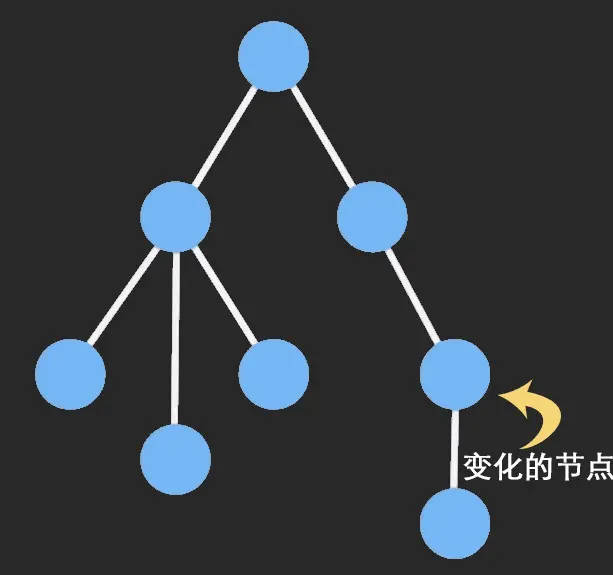

[TOC]

## Immutable.js

由Facebook 工程师 Lee Byron 花费 3 年时间打造，在js中的引用赋值可以节省内存，但随着应用的不断复杂后，状态的改变往往会变成噩梦，通常的做法是**复制数据**来避免被修改，但这样又造成了CPU和内存的消耗，而Immutable利用**结构共享**可以很好地解决这些问题。

* 复制数据：shallowCopy或deepCopy
* 结构共享：尽量复用内存

Immutable Data 是一旦创建，就不能再被更改的数据。对 Immutable 对象的任何修改或添加删除操作都会返回一个新的 Immutable 对象。Immutable 实现的原理是 Persistent Data Structure（持久化数据结构）

<!--  -->


### Immutable数据类型

* List: 有序索引集，类似JS中的Array。
* Map: 无序索引集，类似JS中的Object。
* OrderedMap: 有序的Map，根据数据的set()进行排序。
* Set: 没有重复值的集合。
* OrderedSet: 有序的Set，根据数据的add进行排序。
* Stack: 有序集合，支持使用unshift()和shift()添加和删除。
* Record: 一个用于生成Record实例的类。类似于JavaScript的Object，但是只接收特定字符串为key，具有默认值。
* Seq: 序列，但是可能不能由具体的数据结构支持。
* Collection: 是构建所有数据结构的基类，不可以直接构建。

### 属性
* size 获取List/Map的长度，等同于ImmutableData.count();

### 方法

#### 全局方法
* `fromJS(value [,converter])`
将一个js数据转换为Immutable类型的数据

* `toJS()`
将一个Immutable数据转换为JS类型的数据

#### Map&List共用方法
* `is(map1,map2)`
判断两个对象是否相等，对两个对象的hashCode和valueOf进行比较（js中是比较两个对象的地址）

* `get(key)/getIn(keys)`
获取数据结构中的数据

* `set(key,val)/setIn(keys,val)`
设置List/Map类型的键值

* `delete(key)/deleteIn(keys)`
删除属性

* `update(key,val=>{})/updateIn(keys,val=>{})`
更新值

* `merge()` 合并
```js
var imC = imA.merge(imB);
```

* `has(key)/hasIn(...key)`
判断是否存在某一个key

* `size  或者 count()`
查看大小

#### List方法
* `push()`
在List末尾插入一个元素

* `pop()`
在List末尾删除一个元素

* `unshift()`
在List首部插入一个元素

* `shift()`
在List首部删除一个元素

* `insert(index,item)`

* 深拷贝与浅拷贝的关系 

### immutable.js使用过程中的一些注意点

* fromJS和toJS会深度转换数据，随之带来的开销较大，尽可能避免使用，单层数据转换使用Map()和List()
* js是弱类型，但Map类型的key必须是string！（也就是我们取值是要用get('1')而不是get(1)）
* 所有针对immutable变量的增删改必须左边有赋值，因为所有操作都不会改变原来的值，只是生成一个新的变量
* 获取深层深套对象的值时不需要做每一层级的判空(JS中如果不判空会报错，immutable中只会给undefined)
* immutable对象直接可以转JSON.stringify(),不需要显式手动调用toJS()转原生
* 判断对象是否是空可以直接用size
* 调试过程中要看一个immutable变量中真实的值，可以chrome中加断点，在console中使用.toJS()方法来查看
