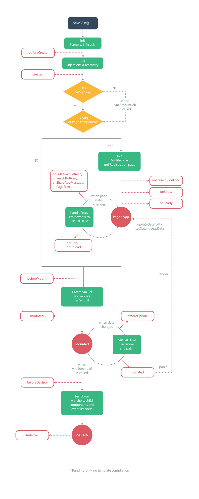

# 框架

## mpvue
mpvue是一个使用 Vue.js 开发小程序的前端框架。框架基于 Vue.js 核心，实现一端开发编译多端（微信，支付宝，头条，百度等）的开发模式
>mpvue: Vue in mini program，
官网地址：http://mpvue.com/mpvue/

### 原理
mpvue 修改了 Vue.js 的 runtime ，mpvue-template-compiler提供了将 vue 的模板语法转换到小程序的 wxml 语法的能力，使其可以运行在小程序环境中，从而为小程序开发引入了整套 Vue.js 开发体验

### 特点
* 彻底的组件化开发能力：提高代码复用性
* 完整的 Vue.js 开发体验
* 方便的 Vuex 数据管理方案：方便构建复杂应用
* 快捷的 webpack 构建机制：自定义构建策略、开发阶段 hotReload
* 支持使用 npm 外部依赖
* 使用 Vue.js 命令行工具 vue-cli 快速初始化项目
* H5 代码转换编译成小程序目标代码的能力

### 使用
* 安装
mpvue基于vue-cli，需全局安装`vue-cli`
* 创建项目
```bash
    vue init mpvue/mpvue-quickstart my-project
```
* 运行项目
```bash
    # 安装依赖
    npm install

    # 运行
    npm run dev
```
* 预览效果（以微信小程序为例，其他小程序同理）
    1. 启动`微信开发者工具`
    2. 引入项目`my-project/dist/wx`
    3. 在模拟器中实时预览mpvue 小程序

### 注意事项
* 小程序里所有的 BOM／DOM 都不能用，也就是说 v-html 等指令不能用
* 不支持部分复杂的 JavaScript 渲染表达式
* 不支持过滤器
* 不支持函数
* 除了 Vue 本身的生命周期外，mpvue 还兼容了小程序生命周期，但除特殊情况外，不建议使用小程序的生命周期钩子
支持Vue所有生命周期函数，在小程序 onReady 后，才去触发 vue mounted 生命周期


## uni-app
uni-app 是一个使用 Vue.js 开发所有前端应用的框架，开发者编写一套代码，可编译到iOS、Android、H5、以及各种小程序（微信/阿里/百度/头条/QQ）等多个平台。

>官网：https://uniapp.dcloud.io/README

> 注意：基于Hbuider开发小程序项目，调试需配置小程序开发工具安装目录（Hbuilder中设置），并打开小程序工具服务端口（小程序工具中设置）

## wePY
WePY (发音: /'wepi/) 是小程序上最早的一款类 Vue 语法、让小程序支持组件化开发的框架，通过预编译的手段让开发者可以选择自己喜欢的开发风格去开发小程序。
>官网: https://wepyjs.github.io/wepy-docs/2.x/#/

### 特点：
* 使用 Vue Observer 实现数据绑定
* 支持 Vue watch/computed/mixin 等特性
* 基于原生组件实现组件化开发
* 支持 TypeScript
